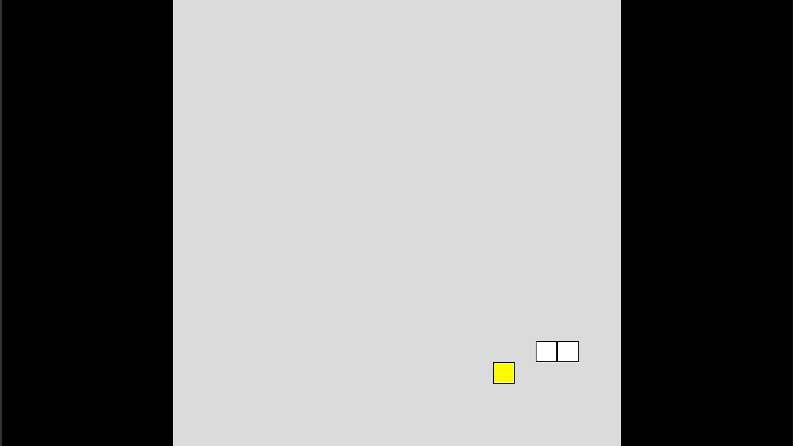

# Snake-Gaming

## Requirements:
- NodeJS Installed
- A web browser, Chrome or Firefox preferably

## How to Run:
- Install Node Packages: `npm i`
- You will need to compile TS to JS: `npm run build`
- A `/dist` folder will be created with compiled JS code. You can then take this folder and open `index.html` to play.

## Develop:
- This utilizes NodeJS and Typescript, install packages: `npm i`
- All code should be motified inside of `/src`, nothing in `/dist` is under version control.